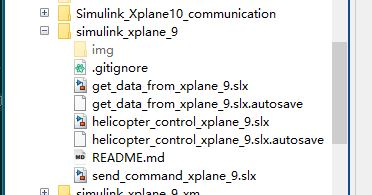
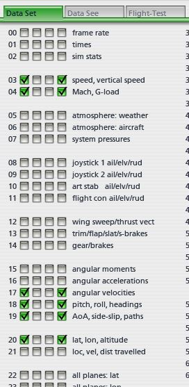
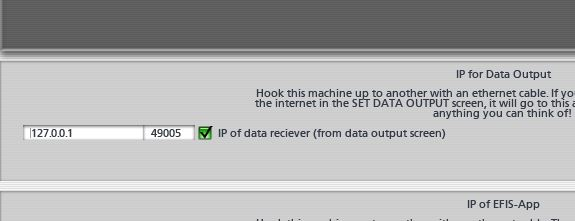
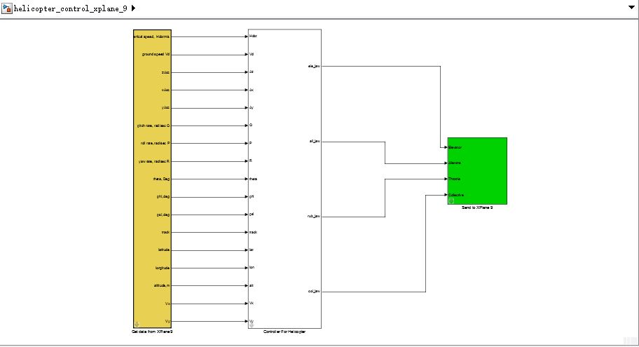
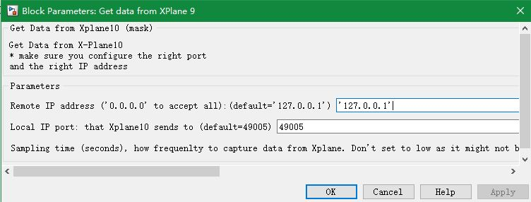

# matCxplane
用 Matlab Simulink 控制 X-Plane 9 进行飞行模拟仿真（直升机）

## 简介
在Matlab下面用Simulink设计直升机控制系统，并和X-Plane 9仿真环境连接，验证控制系统的有效性。其主要目的是为了完成简单飞控系统的设计和验证。
## 使用
你可以在任何安装了Matlab的平台上运行并测试，例如Windows,Linux,MacOS。不过X-Plane 9只支持Windows平台。
## 准备
 - 首先下载该文件
```
	git clone https://github.com/BruceGui/matCxplane.git
```
 - 然后打开Matlab，进入刚才下载的目录，并把当前目录加入Matlab的PATH。如下图所示：
 
 - 双击打开simulink文件helicopter_control_xplane_9即可。
<<<<<<< HEAD

##连接X-Plane 9
=======
 
## 连接X-Plane 9
>>>>>>> f4e1afeca5f505a5eb1bec5896285a81324d4988
X-Plane 9发送和接受数据用的是UDP协议，且其默认的接受端口是49000，发送端口是49005，通过配置IP地址和端口就可以和其进行通信，从而控制模型飞机，进行简单的仿真测试。

选择 Settings->Data Input & Output 配置X-Plane 9发送和显示的数据，如下图所示：



选择 Settings->New Connections 选择数据发送的目标机器，如下图所示：


打开simulink文件，如下图所示.其中黄色部分用于接受来自X-Plane 9的数据，白色部分是简单的控制，绿色部分则是发送四通道控制命令给X-Plane 9。


分别配置接受和发送的IP地址和端口，如下图所示：



其中IP地址如果X-Plane 9在本机，则是127.0.0.1.

<<<<<<< HEAD
##结语
=======
## 结语


>>>>>>> f4e1afeca5f505a5eb1bec5896285a81324d4988
